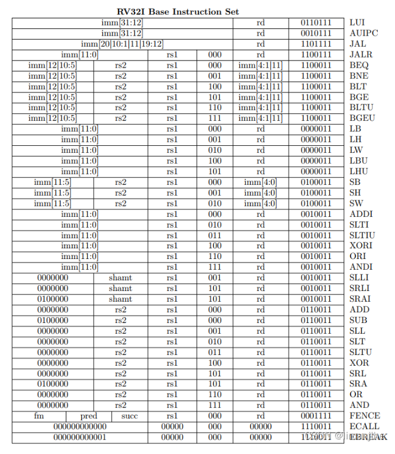
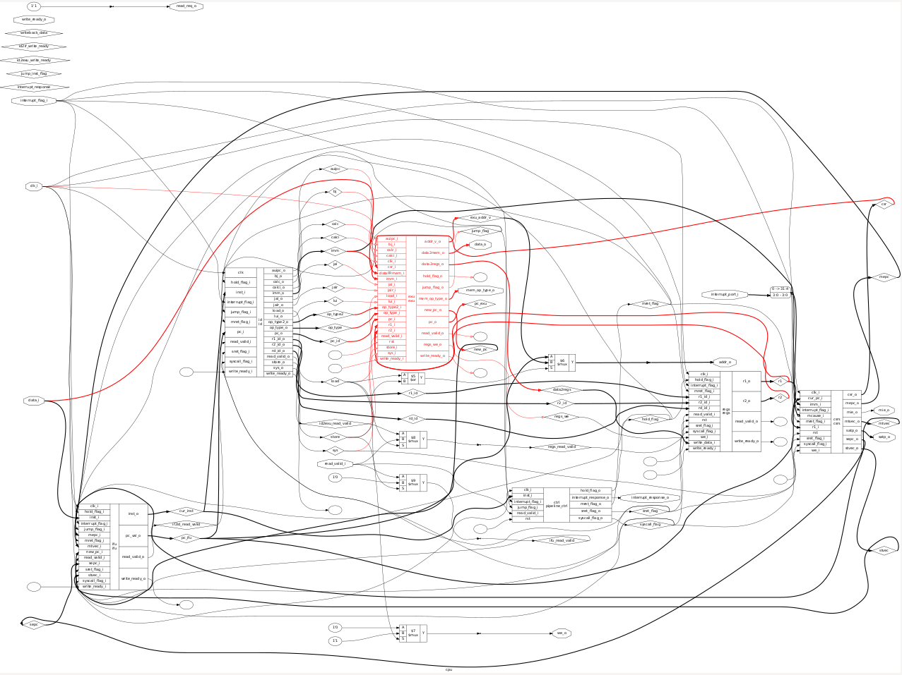
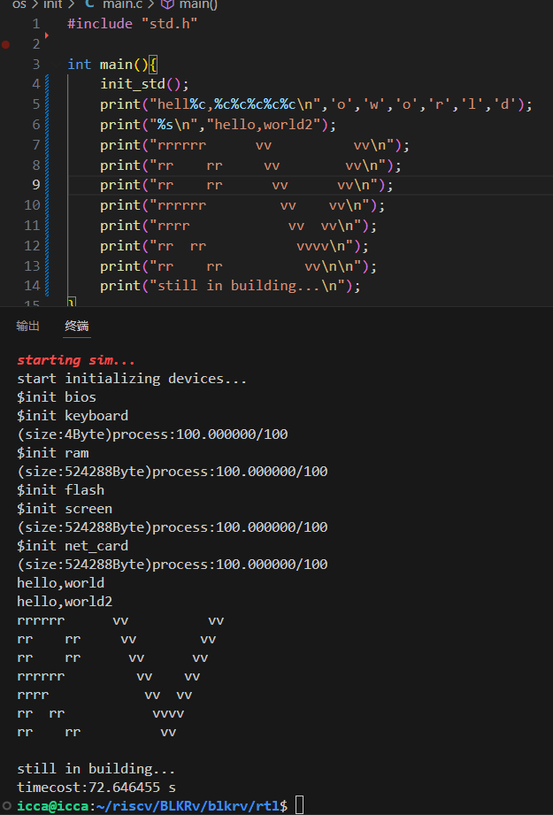
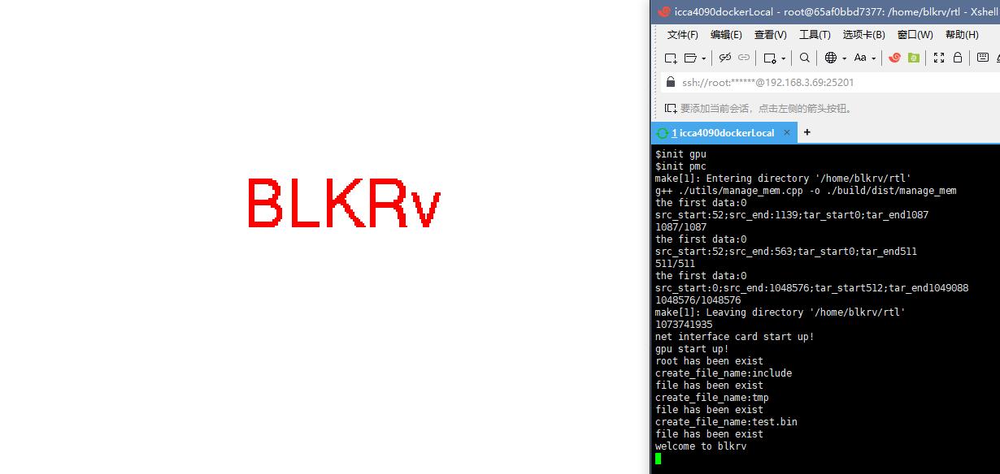

# BLKRv
a platform for new learner

## environment
linux

[verilator](https://blog.csdn.net/m0_59161987/article/details/136761879)

make

[riscv-unknow-elf-gcc](https://blog.csdn.net/m0_59161987/article/details/136761879)(required march:rv32i, mabi:ilp32)

fltk

## usage
### compile
`cd rtl/`

`make` for command version

`make ENABLE_GPU=1` for gui version

### it's time to run!
`make run`

## for more information

https://gitee.com/c-nameless/blkrv-pre-design

## some details
### instructions

csr instruction
+ csrrw rd,csrreg,rs
+ csrrc rd,csrreg,rs
+ csrrs rd,csrreg,rs
+ csrrwi rd,csrreg,imm
+ csrrci rd,csrreg,imm
+ csrrsi rd,csrreg,imm
### hardware architecture

### test result

### gui result

## os
[syscall_func](./os/doc/syscall_func.md)
   