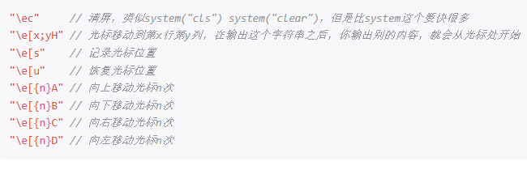

input执行失败，in_cache_front的地址在bootsect的时候被占用，导致初始化不为0；
解决：读取elf文件的程序头，将各段分别加载。

触发中断时，如果遇到lw，sw，会产生指令的变化冲突
解决：在pipelinectrl部件中控制holdflag信号的产生，当interrupt产生时，不产生holdflag

连续触发中断，mie来不及变化，产生两个中断信号导致mepc值错误
解决：将interflag信号也加入判断

interrupt信号遇到跳转指令时-8，导致读取了跳转指令跳转地址的-4偏移地址，一般为ret，导致出错。但如果不减8，-4的话，会导致正常指令应该执行处未执行。
解决：已经跳转修改pc的应该-4，尚未修改pc的任何指令应该-8,在ifu中新增jumpedflag信号，用于标记是否完成pc修改

interrupt信号遇到holdflag指令执行导致存储pc值错误
解决：增加pc变化信号值，检测到不同值，更新不同的mepc。

触发中断时遇到sret信号。
解决：产生sretflag信号处加入中断判断

触发中断时syscall修改pc
解决，ifu的syscall信号处添加pcchange信号

syscall4出现无法传参的错误，这由于编译器编译内联汇编时无法识别a寄存器参数位置，导致覆盖
解决，将参数先存到t寄存器，再传给ecall系统调用函数

